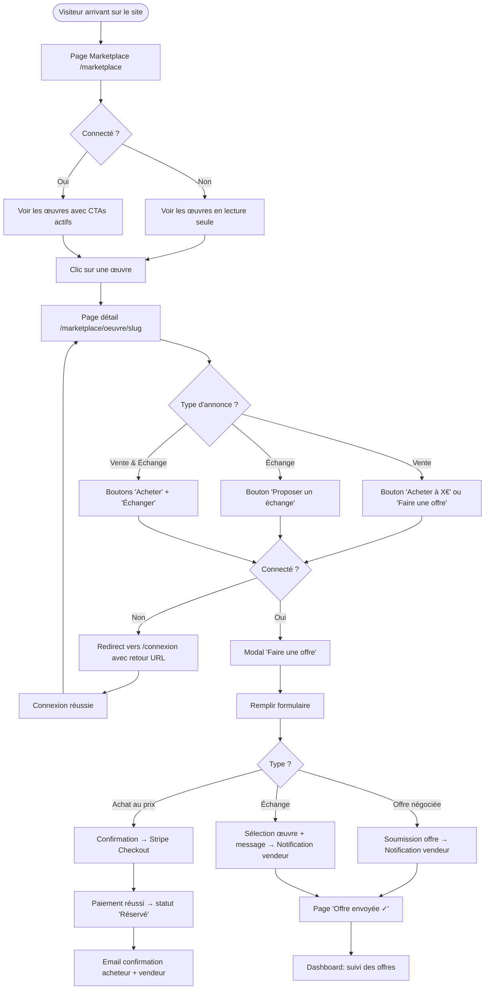
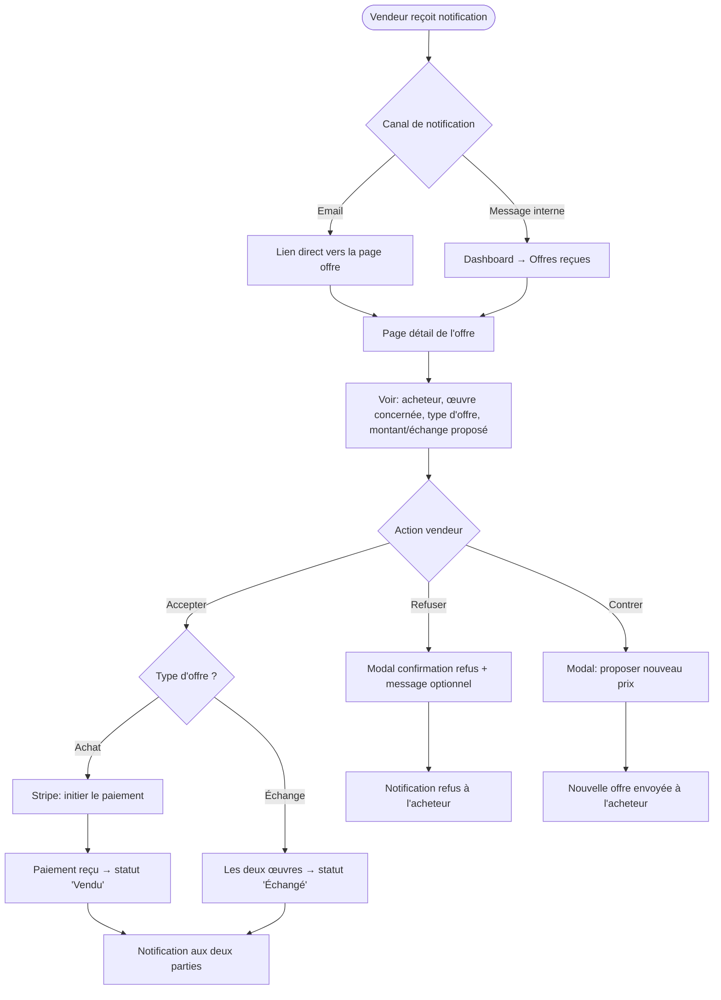
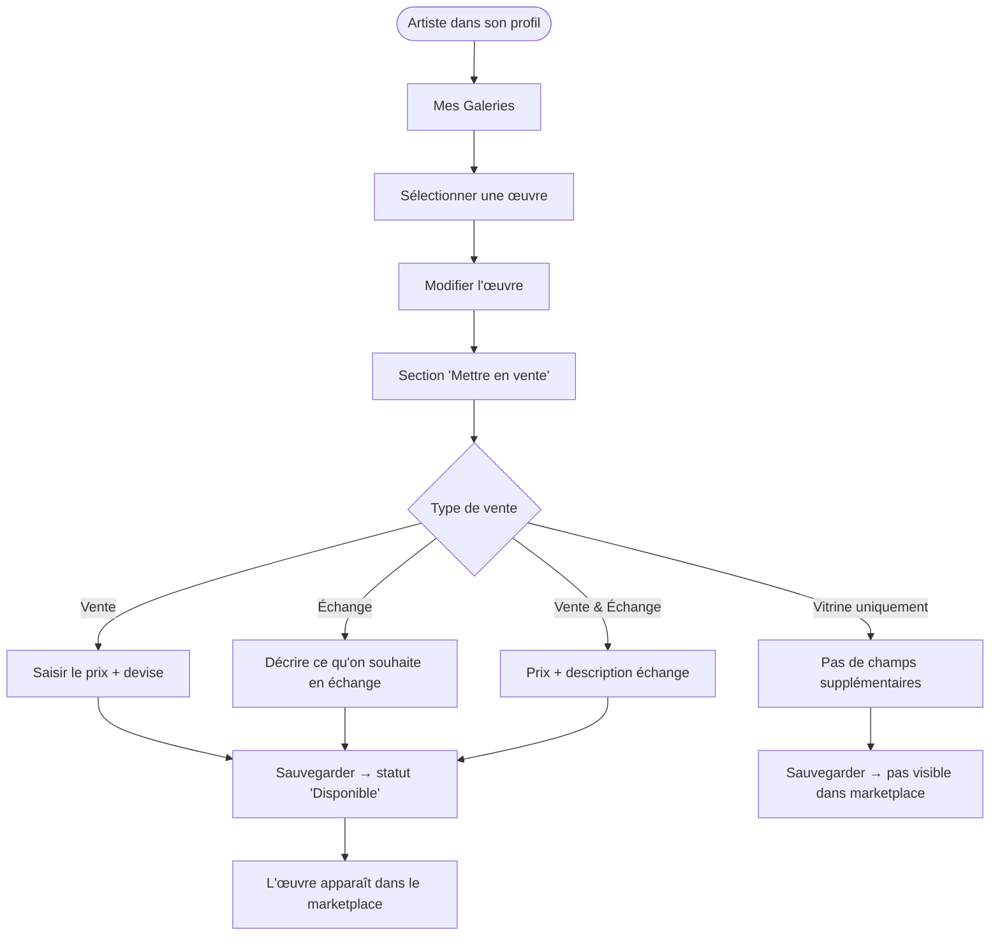

# UX Design Specification — Avenue des Artistes : Marketplace Artistique

**Auteur:** pol
**Date:** 2026-03-30
**Version:** 1.0

---

## Executive Summary

### Vision Produit

Avenue des Artistes est une communauté d'artistes qui partage ses œuvres. La prochaine étape naturelle est de transformer ces galeries-vitrines en **galeries-marchandes** : permettre à chaque artiste de vendre ou d'échanger ses œuvres directement avec d'autres utilisateurs, sans intermédiaire, sans commission, dans un esprit de solidarité artistique.

Ce n'est pas un marketplace comme les autres — c'est un lieu où l'art circule entre humains qui se font confiance.

### Utilisateurs Cibles

**Profil principal — L'artiste vendeur/échangeur :**
- Artiste amateur ou semi-professionnel
- Déjà inscrit sur la plateforme, a au moins une galerie
- Veut valoriser son travail sans passer par des plateformes impersonnelles (Etsy, etc.)
- Sensible à la communauté, aime l'idée d'échanger plutôt que de vendre
- Utilise surtout desktop pour créer/gérer, mobile pour parcourir

**Profil secondaire — L'acheteur/échangeur :**
- Amoureux de l'art, pas forcément artiste lui-même
- Parcourt la plateforme depuis son mobile le soir
- Veut découvrir des œuvres uniques, originales, pas des reproductions
- Fait confiance à la communauté pour la qualité

**Profil tertiaire — L'artiste-acheteur :**
- Artiste qui veut acquérir l'œuvre d'un autre artiste
- Très intéressé par l'échange (troc artistique)
- Rôle dual : il est à la fois vendeur et acheteur

### Défis UX Clés

1. **Le rôle dual** — Un artiste peut être simultanément vendeur ET acheteur. La navigation doit clairement distinguer les deux contextes sans créer de confusion.
2. **La confiance** — Sans système de notation (phase 2), les utilisateurs doivent faire confiance à la plateforme et aux profils. Le design doit inspirer sérieux et authenticité.
3. **Le flux d'offre** — Le processus d'offre (achat ou échange) doit être ultra-simple, 3 clics maximum, sans friction.
4. **L'existant fragile** — Le CSS actuel est quasi inexistant (21 lignes), les classes personnalisées sont non définies. Toute amélioration doit être compatible avec Bootstrap 4 Cerulean existant.
5. **Mobile ignoré** — La carte Leaflet est `width: 500px` hardcodé. Le marketplace sera principalement consulté sur mobile.

### Opportunités Design

1. **Les cartes d'œuvres** — Des cartes produit soignées avec image, prix, type (vente/échange), artiste. C'est le cœur visuel du marketplace.
2. **Le profil-galerie** — Le profil d'un artiste devient une véritable vitrine marchande. Un lien naturel entre la galerie existante et ses œuvres en vente.
3. **Le flux d'échange** — La proposition d'échange (proposer UNE de ses propres œuvres) est unique et différenciante. Un UX bien pensé ici crée de la magie.
4. **Les filtres contextuels** — Filtrer par type (vente/échange), catégorie artistique, fourchette de prix, localisation — des filtres qui correspondent à de vraies intentions utilisateur.

---

## Core User Experience

### L'Expérience Définissante

> **"Trouver une œuvre qui me parle, et contacter l'artiste en 3 clics."**

Comme Airbnb où l'on browse des logements et on réserve, ou Vinted où l'on chine et on achète — Avenue des Artistes doit permettre de passer de la découverte à l'intention d'achat/échange de façon fluide et rapide.

Le cycle complet : **Découverte → Coup de cœur → Offre → Échange/Achat**

### Stratégie de Plateforme

- **Web responsive** en priorité (pas d'app native)
- **Mobile-first** pour la navigation du marketplace (browsing depuis le canapé)
- **Desktop-optimisé** pour la gestion de galerie et d'annonces (création de contenu)
- Framework existant : Bootstrap 4 Cerulean, Symfony/Twig — on évolue, on ne repart pas de zéro

### Interactions Sans Friction

- **Parcourir le marketplace** → scroll infini ou pagination légère, filtres persistants
- **Voir une œuvre** → page détail claire : image grande, prix, description, profil artiste, bouton CTA
- **Faire une offre** → modal simple, formulaire court, confirmation immédiate
- **Gérer ses annonces** → tableau de bord depuis son profil, statuts clairs

### Moments Critiques

| Moment | Ce qui doit se passer |
|--------|----------------------|
| Premier chargement du marketplace | L'utilisateur voit des œuvres belles et variées immédiatement |
| Clic sur une œuvre | La page détail charge vite, l'image est grande et belle |
| Soumission d'une offre | Confirmation visuelle immédiate, message rassurant |
| Réception d'une offre (vendeur) | Notification claire, action en un clic (accepter/refuser) |
| Offre acceptée | Célébration légère, instructions claires pour la suite |

### Principes d'Expérience

1. **Authenticité avant tout** — Les œuvres sont le héros. Pas de surcharge décorative.
2. **Confiance par la transparence** — Afficher clairement l'artiste, sa localisation, ses œuvres existantes.
3. **3 clics maximum** — Du marketplace à l'offre soumise, jamais plus de 3 étapes.
4. **Zéro anxiété transactionnelle** — Les messages de statut sont clairs, les erreurs explicables, les actions réversibles.

---

## Réponse Émotionnelle Désirée

### Objectifs Émotionnels Primaires

**Pour l'acheteur/échangeur :**
- **Inspiration** — "Oh, je n'avais pas vu ça comme ça... cette aquarelle est magnifique."
- **Confiance** — "Je peux contacter cet artiste, c'est une vraie personne dans une vraie communauté."
- **Accomplissement** — "J'ai trouvé quelque chose d'unique que personne d'autre n'a."

**Pour le vendeur/échangeur :**
- **Fierté** — "Ma galerie est maintenant une vraie vitrine professionnelle."
- **Excitation** — "J'ai reçu une offre !"
- **Simplicité** — "Gérer mes annonces ne me prend pas de temps."

### Cartographie Émotionnelle du Parcours

```
Découverte → [Curiosité] → Exploration → [Intérêt] → Coup de cœur → [Désir]
→ Offre → [Légère anxiété "est-ce que ça va marcher ?"] → Confirmation → [Soulagement]
→ Réponse → [Anticipation] → Acceptée → [Joie] / Refusée → [Légère déception + rebond]
```

### Micro-Émotions à Gérer

| Moment | Émotion cible | Comment l'atteindre |
|--------|--------------|---------------------|
| Chargement lent | Patience → Pas de frustration | Skeleton screens, images lazy-loaded |
| Formulaire d'offre | Confiance | Labels clairs, pas de champs inutiles |
| Erreur de paiement | Compréhension, pas panique | Message d'erreur humain, solution proposée |
| Offre refusée | Dignité préservée | Ton respectueux, encouragement à continuer |
| Première vente | Célébration ! | Animation légère, message de félicitation |

### Implications Design

- **Authenticité** → Photos d'œuvres grandes, pas de stock photos, profils humains
- **Confiance** → Couleurs douces et sérieuses, pas de flashy commercial
- **Accomplissement** → Micro-animations de confirmation (✓ animé, confetti discret)
- **Simplicité** → Espaces généreux, hiérarchie claire, pas de surcharge informationnelle

---

## Analyse UX & Inspiration

### Produits Inspirants Analysés

**Vinted** (marketplace C2C)
- ✅ Filtres mobiles en bottom sheet — fluide et naturel
- ✅ Cards produit compactes mais informatives (image, prix, taille, vendeur)
- ✅ Processus d'offre simple et guidé
- ❌ Trop commercial, perd l'aspect communautaire

**Etsy** (marketplace artisanat)
- ✅ Mise en valeur de l'artisan (photo de profil, histoire, localisation)
- ✅ Photos de produit multiples avec zoom
- ✅ "Shop" de l'artisan = galerie personnelle
- ❌ Interface dense et complexe pour les petits vendeurs

**Airbnb** (inspiration UX générale)
- ✅ Filtres intuitifs avec résultats en temps réel
- ✅ Cards avec photo dominante, informations essentielles seulement
- ✅ Page détail avec CTA flottant sur mobile

**Behance** (galeries créatives)
- ✅ Mise en valeur visuelle des créations, grille masonry
- ✅ Profil artiste = portfolio professionnel
- ❌ Pas de dimension transactionnelle

### Patterns UX Transférables

**Navigation :**
- Filtres en sidebar sur desktop, bottom sheet sur mobile (Vinted pattern)
- Barre de recherche sticky en haut
- Pagination avec "Charger plus" plutôt que pagination numérotée

**Cards Œuvres :**
- Image dominante (75% de la card)
- Badge type (VENTE / ÉCHANGE / VENTE & ÉCHANGE)
- Prix ou "À l'échange" clairement visible
- Avatar + nom artiste en footer de card

**Page Détail :**
- Galerie photos plein écran (swipeable mobile)
- CTA fixe en bas sur mobile ("Faire une offre")
- Section artiste avec lien vers sa galerie complète
- Œuvres similaires du même artiste

### Anti-Patterns à Éviter

- ❌ **Formulaires longs** — Chaque champ inutile est un abandon potentiel
- ❌ **Pop-ups intrusifs** — Pas de "Inscrivez-vous pour voir le prix"
- ❌ **Pagination avec numéros** — Sur mobile, le scroll est naturel
- ❌ **Images petites** — L'art doit être vu en grand
- ❌ **Statuts ambigus** — "En attente" ne veut rien dire : "Offre reçue, en attente de votre réponse" ✓

---

## Fondation Design System

### Choix du Design System

**Décision : Bootstrap 4 Cerulean — Évolution Progressive**

Repartir de zéro serait destructeur (réécriture complète de tous les templates Twig). On **évolue l'existant** :
1. Ajouter les variables CSS custom sur top de Bootstrap 4
2. Créer les classes manquantes (`.bouton`, `.titre`, `.massenet`, etc.)
3. Remplacer progressivement les styles inline par des classes
4. Préparer une migration Bootstrap 5 pour une phase future

### Justification

- Continuité avec l'existant (zéro régression)
- Équipe solo = pas de temps pour réécriture complète
- Bootstrap 4 couvre déjà 80% des besoins (grille, formulaires, modals)
- Les 20% restants = classes custom + CSS variables

### Approche d'Implémentation

```css
/* Couche 1 : Variables CSS (nouveau) */
:root {
  --primary: #2fa4e7;
  --primary-dark: #1a8fd1;
  --primary-light: #5bb8f0;
  /* ... */
}

/* Couche 2 : Classes Bootstrap 4 (existant) */
/* Ne pas toucher aux fichiers Bootstrap */

/* Couche 3 : Classes custom (à créer dans app.css) */
.bouton { ... }
.titre { ... }
.massenet { ... }
```

### Stratégie de Personnalisation

- **Token system** : Variables CSS pour couleurs, espacements, typographie
- **Composants custom** : Uniquement pour ce que Bootstrap ne couvre pas (ArtworkCard, OfferModal, StatusBadge)
- **Pas de surcharge Bootstrap** : Ajouter des classes, ne pas modifier les existantes

---

## 2. Core User Experience

### 2.1 L'Expérience Définissante

> **Avenue des Artistes :** "Proposer une offre sur une œuvre d'art"

Comme Tinder swipe, comme Airbnb "Réserver", comme Vinted "Acheter" — le geste définissant d'Avenue des Artistes est **"Faire une offre"**.

C'est le moment où un visiteur devient acteur, où l'art change de main.

### 2.2 Modèle Mental Utilisateur

**Ce que l'utilisateur pense :**
- "Je vois une œuvre qui me plaît"
- "Est-ce que le prix est raisonnable ?"
- "Comment je contacte l'artiste ?"
- "Qu'est-ce qui se passe après ?"

**Ce qu'il s'attend à trouver :**
- Un bouton CTA évident ("Faire une offre", "Acheter", "Proposer un échange")
- Un formulaire court (pas plus de 3 champs)
- Une confirmation immédiate
- Une information sur les prochaines étapes

### 2.3 Critères de Succès

- L'utilisateur soumet une offre en moins de 2 minutes depuis la page marketplace
- Le vendeur reçoit une notification claire dans les secondes qui suivent
- Le vendeur peut accepter/refuser en 1 clic depuis la notification
- L'acheteur est informé de la décision sans avoir à revenir manuellement

### 2.4 Patterns UX : Établis

Le flux "Faire une offre" est un pattern connu : formulaire en modal, confirmation par email/notification. Pas besoin d'inventer — juste bien exécuter.

**Notre différenciateur :** Le flux d'échange (proposer UNE de ses propres œuvres en contrepartie) est unique. UI à soigner particulièrement.

### 2.5 Mécanique de l'Expérience

**Flux Achat :**
```
[Voir œuvre] → [Clic "Acheter"] → [Modal: "Confirmer l'achat à X€ ?"]
→ [Confirmer] → [Stripe Checkout] → [Confirmation] → [Notification vendeur]
```

**Flux Offre négociée :**
```
[Voir œuvre] → [Clic "Faire une offre"] → [Modal: prix proposé + message optionnel]
→ [Envoyer] → [Confirmation "Offre envoyée !"] → [Notification vendeur]
→ [Vendeur: Accepter/Refuser/Contrer] → [Notification acheteur]
```

**Flux Échange :**
```
[Voir œuvre] → [Clic "Proposer un échange"] → [Modal: sélectionner une de mes œuvres
+ description de ce que je propose] → [Envoyer] → [Confirmation]
→ [Notification vendeur] → [Vendeur: Accepter/Refuser]
→ Si accepté: les deux œuvres passent en statut "Échangé"
```

---

## Fondation Visuelle

### Système de Couleurs

**Palette Principale :**

| Token | Valeur | Usage |
|-------|--------|-------|
| `--primary` | `#2fa4e7` | CTA principaux, liens actifs, badges primaires |
| `--primary-dark` | `#1a8fd1` | Hover sur primary |
| `--primary-light` | `#7cc8f0` | Backgrounds légers, highlights |
| `--secondary` | `#6c757d` | Textes secondaires, icônes inactives |
| `--success` | `#28a745` | Statut "Disponible", confirmations |
| `--warning` | `#f0a500` | Statut "Réservé", alertes non critiques |
| `--danger` | `#dc3545` | Erreurs, statut "Vendu/Échangé" (inactif) |
| `--text-dark` | `#212529` | Corps de texte principal |
| `--text-muted` | `#6c757d` | Textes secondaires, placeholders |
| `--bg-light` | `#f8f9fa` | Fond pages, cards |
| `--white` | `#ffffff` | Surfaces, modals |
| `--border` | `#dee2e6` | Séparateurs, bordures |

**Couleurs Sémantiques Statuts :**

| Statut | Couleur | Badge |
|--------|---------|-------|
| Disponible | `#28a745` vert | `.badge-success` |
| Réservé | `#f0a500` orange | `.badge-warning` |
| Vendu | `#6c757d` gris | `.badge-secondary` |
| Échangé | `#6c757d` gris | `.badge-secondary` |

**Conformité WCAG AA :**
- `#2fa4e7` sur blanc : ratio 3.1:1 (AA pour grands textes ✓)
- `#1a8fd1` sur blanc : ratio 4.5:1 (AA ✓)
- `#212529` sur `#f8f9fa` : ratio 16:1 (AAA ✓)

### Système Typographique

**Fonts :**
- `Massenet` — Titres, éléments de marque, navigation (police identitaire du projet)
- `System UI / -apple-system` — Corps de texte (performance, lisibilité native)

**Échelle Typographique :**

| Token | Taille | Usage |
|-------|--------|-------|
| `--text-xs` | `0.75rem / 12px` | Labels, métadonnées |
| `--text-sm` | `0.875rem / 14px` | Textes secondaires, captions |
| `--text-base` | `1rem / 16px` | Corps principal |
| `--text-lg` | `1.125rem / 18px` | Intro paragraphs |
| `--text-xl` | `1.5rem / 24px` | Titres de section (h3) |
| `--text-2xl` | `2rem / 32px` | Titres de page (h2) |
| `--text-3xl` | `2.5rem / 40px` | Titre principal (h1) |

**Règles Typographiques :**
- `Massenet` pour `.titre`, `.navbar-brand`, titres h1/h2 de page
- System UI pour tout le reste (lisibilité maximale)
- Line-height : 1.6 pour le corps, 1.2 pour les titres
- Pas de texte sous 14px pour le contenu principal

### Fondation Espacement & Layout

**Unité de base : 8px**

| Token | Valeur | Usage |
|-------|--------|-------|
| `--space-1` | `8px` | Micro-spacing (icône↔texte) |
| `--space-2` | `16px` | Padding interne composants |
| `--space-3` | `24px` | Espacement entre éléments |
| `--space-4` | `32px` | Espacement entre sections |
| `--space-5` | `48px` | Grandes séparations |
| `--space-6` | `64px` | Sections de page |

**Grille :**
- Bootstrap 4 grid (12 colonnes)
- Marketplace : 4 colonnes desktop, 2 tablette, 1 mobile
- Max-width container : `1200px`

**Bordures & Ombres :**
- `--radius-sm: 4px` — Badges, inputs
- `--radius-md: 8px` — Cards, boutons
- `--radius-lg: 16px` — Modals, panels
- `--shadow-card: 0 2px 8px rgba(0,0,0,0.08)` — Cards au repos
- `--shadow-card-hover: 0 8px 24px rgba(0,0,0,0.15)` — Cards au survol

### Considérations d'Accessibilité

- Contraste minimum WCAG AA sur tous les textes
- Taille touch target minimum `44x44px` sur mobile
- Focus visible sur tous les éléments interactifs (`outline: 3px solid var(--primary)`)
- Alt text obligatoire sur toutes les images d'œuvres
- ARIA labels sur icônes Font Awesome seules

---

## Direction Design

### Directions Explorées

**Direction A — "Galerie Épurée"**
- Fond blanc dominant, grille serrée, images pleine largeur
- Typographie sobre, peu de couleur
- Inspiration : Behance, galeries contemporaines
- ✅ Met l'art au premier plan / ❌ Peut paraître froid

**Direction B — "Marketplace Chaleureux"**
- Fond gris très clair (#f8f9fa), cards avec légère ombre
- Couleur primaire utilisée avec parcimonie sur les CTAs
- Cards avec badge coloré sur l'image
- Inspiration : Etsy modifié, Vinted épuré
- ✅ Familier, rassurant, fonctionnel / ✅ Compatible avec Bootstrap 4 existant

**Direction C — "Portfolio Artistique"**
- Layout asymétrique, typographie expressive
- Grandes photos en full-bleed
- Navigation latérale desktop
- ✅ Très distinctif / ❌ Trop complexe à implémenter avec Symfony/Twig

### Direction Choisie : **B — "Marketplace Chaleureux"**

**Rationale :**
1. Compatible avec Bootstrap 4 existant → implémentation réaliste
2. Familière pour les utilisateurs habitués aux C2C (Vinted, Leboncoin)
3. Met en valeur les œuvres sans surcharge décorative
4. Évolutive : peut s'affiner vers A sans réécriture

**Éléments clés à retenir :**
- Fond `#f8f9fa` pour les pages liste
- Cards blanches avec `border-radius: 8px` et ombre douce
- Badge coloré en overlay sur l'image (type annonce)
- CTA bleu `#2fa4e7` sur fond blanc
- Section artiste avec avatar et lien vers profil

---

## Flux Utilisateur

### Flux 1 — Découverte et Achat d'une Œuvre



### Flux 2 — Gestion d'une Offre Reçue (Vendeur)



### Flux 3 — Mise en Vente d'une Œuvre Existante



### Patterns de Flux

**Navigation :**
- Fil d'Ariane systématique : `Marketplace > Catégorie > Titre de l'œuvre`
- Bouton retour natif préservé (pas de SPA)
- URL propres et partageables pour chaque œuvre

**Décisions :**
- Maximum 1 décision par écran pour les utilisateurs non-experts
- Options présentées avec conséquences claires ("Accepter → l'œuvre sera marquée Réservée")

**Feedback :**
- Toast notification en haut à droite pour les actions réussies
- Messages d'erreur inline dans les formulaires (pas de page d'erreur générique)
- Loading states sur tous les boutons d'action (éviter double-clic)

**Principes d'Optimisation des Flux :**
- Minimum de clics pour atteindre l'objectif (règle des 3 clics)
- Pré-remplissage des champs quand possible (ex: sélection d'œuvre pour l'échange)
- Sauvegarde automatique des brouillons d'offres
- Confirmation avant toute action irréversible (refus, suppression)

---

## Stratégie de Composants

### Composants Bootstrap 4 Utilisés (Existants)

| Composant | Usage |
|-----------|-------|
| `.card` | Base des cards d'œuvres, profil artiste |
| `.modal` | Formulaire d'offre, confirmation d'action |
| `.badge` | Statuts (Disponible, Réservé, Vendu) |
| `.btn` | Tous les CTAs |
| `.form-control` | Inputs des formulaires |
| `.navbar` | Navigation principale |
| `.pagination` | Navigation du marketplace |
| `.alert` | Flash messages Symfony |
| `.dropdown` | Menus contextuels, filtres |
| `.toast` | Notifications temps réel |

### Composants Custom à Créer

#### `ArtworkCard` — Card Œuvre Marketplace

```
┌──────────────────────────┐
│  [IMAGE de l'œuvre]      │  ← aspect-ratio: 4/3, object-fit: cover
│  [BADGE: VENTE]          │  ← overlay top-right
├──────────────────────────┤
│  Titre de l'œuvre        │  ← font-weight: 600, 1 ligne max
│  [AVATAR] Nom Artiste    │  ← text-sm, text-muted
│  ★ Lyon                  │  ← localisation, text-sm
├──────────────────────────┤
│  120 €      [Voir →]     │  ← prix bold, CTA primaire
└──────────────────────────┘
```

**États :** default, hover (ombre+translateY), indisponible (overlay grisé)
**Variants :** standard, compact (liste), featured (grande card homepage)
**Accessibilité :** `role="article"`, `aria-label="Œuvre: {titre} par {artiste}"`

#### `OfferModal` — Modal de Soumission d'Offre

```
┌─────────────────────────────────┐
│  Faire une offre                │  ← Titre
│  ─────────────────────────────  │
│  [Image miniature] Titre œuvre  │
│  Prix demandé : 120 €           │
│  ─────────────────────────────  │
│  Votre offre (€) [______]       │  ← optionnel si achat direct
│  Message à l'artiste [_______]  │  ← textarea, optionnel
│                  [Annuler] [OK] │
└─────────────────────────────────┘
```

**Variant Échange :**
```
│  Quelle œuvre proposez-vous ?   │
│  [Sélecteur mes œuvres]         │
│  Description de votre échange   │
│  [_______________________________]│
```

#### `StatusBadge` — Badge Statut Annonce

```
.badge-status-available    → vert  → "Disponible"
.badge-status-reserved     → orange → "Réservé"
.badge-status-sold         → gris   → "Vendu"
.badge-status-exchanged    → gris   → "Échangé"
```

#### `OfferCard` — Card Offre Reçue/Envoyée (Dashboard)

```
┌─────────────────────────────────┐
│  [Image miniature] Titre œuvre  │
│  Type: Achat · 100 € · il y a 2h│
│  De: Marie L. [voir profil]     │
│  Message: "J'adore cette..."    │
│                                 │
│  [Refuser] [Contrer] [Accepter] │
└─────────────────────────────────┘
```

#### `FilterSidebar` — Panneau de Filtres

**Desktop :** Sidebar fixe à gauche
**Mobile :** Bottom sheet avec backdrop

Filtres à inclure :
- Type : [Vente] [Échange] [Vente & Échange]
- Catégorie : dropdown multi-select
- Prix : range slider (min/max)
- Localisation : rayon en km (si géolocalisation) ou région
- Tri : Récent | Prix ↑ | Prix ↓

### Roadmap d'Implémentation

**Phase 1 — Composants Critiques (Sprint 1)**
- `ArtworkCard` — nécessaire pour le marketplace
- `StatusBadge` — nécessaire partout
- `OfferModal` (version achat) — flux principal

**Phase 2 — Composants Transactionnels (Sprint 2)**
- `OfferModal` (version échange)
- `OfferCard` — dashboard
- `FilterSidebar` — UX du marketplace

**Phase 3 — Composants Enhancement (Sprint 3)**
- Carousel d'images sur page détail
- Skeleton screens (loading states)
- Toast notifications
- Composants de célébration (offre acceptée)

---

## Patterns UX de Cohérence

### Hiérarchie des Boutons

```
PRIMARY  : btn btn-primary  → Faire une offre, Acheter, Sauvegarder
SECONDARY: btn btn-outline-primary → Voir la galerie, Modifier
DANGER   : btn btn-danger   → Supprimer, Refuser (avec confirmation)
LINK     : btn btn-link     → Annuler, Retour
```

**Règle :** Maximum 1 bouton PRIMARY par vue. Le CTA principal est toujours le plus visible.

### Patterns de Feedback

**Succès :** Toast vert en haut à droite, disparaît après 4s
```
✓ Offre envoyée avec succès ! [×]
```

**Erreur :** Alert rouge inline dans le formulaire concerné
```
⚠ Le prix doit être supérieur à 0 €
```

**Confirmation d'action irréversible :** Modal avec deux boutons
```
Êtes-vous sûr de vouloir refuser cette offre ?
Cette action est définitive.
[Annuler]  [Oui, refuser]
```

**Loading :** Spinner sur le bouton + désactivation du formulaire
```
[⟳ Envoi en cours...]  ← bouton désactivé
```

### Patterns de Formulaires

**Labels :** Toujours au-dessus du champ (pas de placeholder seul)
**Validation :** Inline, après blur sur le champ (pas au submit)
**Champs obligatoires :** Astérisque rouge + mention "(requis)"
**Aide contextuelle :** Texte en `.form-text.text-muted` sous le champ

**Pattern de sélection d'œuvre (échange) :**
- Grid 3 colonnes avec images cliquables
- État sélectionné : bordure bleue + checkmark
- Un seul choix possible (radio behavior)

### Patterns de Navigation

**Navbar desktop :**
```
[Logo Avenue des Artistes] [Marketplace] [Ma Galerie] [Messages] [Mon Compte ▾] [Déconnexion]
```

**Navbar mobile :**
```
[≡] [Logo] [🔔] [👤]
```
Bottom navigation (si appli-like) ou hamburger menu standard

**Breadcrumb :** Systématique sur toutes les pages secondaires
```
Accueil > Marketplace > Aquarelles > "La Seine au crépuscule"
```

### Patterns État Vide & Loading

**Liste vide (marketplace sans résultat) :**
```
┌──────────────────────────────────┐
│   🎨                             │
│   Aucune œuvre ne correspond     │
│   à vos critères de recherche.   │
│                                  │
│   [Effacer les filtres]          │
└──────────────────────────────────┘
```

**Skeleton screens pour les cards :**
```
┌──────────────┐  ┌──────────────┐
│░░░░░░░░░░░░░░│  │░░░░░░░░░░░░░░│
│░░░░░░░░░░░░░░│  │░░░░░░░░░░░░░░│
│──────────────│  │──────────────│
│░░░░░░        │  │░░░░░░        │
│░░░░          │  │░░░░          │
└──────────────┘  └──────────────┘
```

---

## Responsive Design & Accessibilité

### Stratégie Responsive

**Mobile First (320px → ∞)**

Le marketplace sera principalement consulté sur mobile. On part du mobile et on enrichit pour desktop.

**Mobile (320px - 767px) :**
- 1 colonne pour les cards marketplace
- Navigation : hamburger menu + bottom bar optionnelle
- Filtres : bottom sheet avec backdrop semi-transparent
- CTA "Faire une offre" : fixe en bas de la page détail
- Images : pleine largeur, hauteur automatique
- Carte Leaflet : hauteur 250px, largeur 100%

**Tablette (768px - 1023px) :**
- 2 colonnes pour les cards marketplace
- Navigation : navbar standard avec collapse
- Filtres : sidebar rétractable
- Formulaires : layout 2 colonnes

**Desktop (1024px+) :**
- 3-4 colonnes pour les cards marketplace
- Navigation : navbar complète visible
- Filtres : sidebar fixe à gauche (280px)
- Page détail : layout 2 colonnes (image gauche, info droite)
- Dashboard : tableau full-width avec colonnes

### Stratégie de Breakpoints

```css
/* Mobile first */
/* Base styles: mobile */

@media (min-width: 576px) { /* sm: petites tablettes */ }
@media (min-width: 768px) { /* md: tablettes */ }
@media (min-width: 992px) { /* lg: desktop */ }
@media (min-width: 1200px) { /* xl: grand desktop */ }

/* Préférences utilisateur */
@media (prefers-reduced-motion: reduce) {
  * { animation: none !important; transition: none !important; }
}
@media (prefers-color-scheme: dark) {
  /* Phase 2 - Dark mode */
}
```

### Stratégie d'Accessibilité

**Niveau cible : WCAG 2.1 AA**

**Couleurs & Contrastes :**
- Texte normal : ratio min 4.5:1
- Grands textes (18px+) : ratio min 3:1
- Composants UI et états focus : ratio min 3:1
- Ne jamais communiquer une information par la couleur seule (toujours icône + texte)

**Navigation au Clavier :**
- Skip link "Aller au contenu" en premier élément de page
- Ordre de tabulation logique (ne pas utiliser tabindex > 0)
- Tous les éléments interactifs accessibles au clavier
- Focus trap dans les modals

**Lecteurs d'Écran :**
- Landmarks sémantiques : `<header>`, `<nav>`, `<main>`, `<footer>`
- Titres hiérarchiques : une seule `<h1>` par page
- Images d'œuvres : `alt="Titre de l'œuvre par Nom Artiste, catégorie"`
- Icônes Font Awesome : `aria-hidden="true"` + texte visible ou `aria-label`
- Modal : `role="dialog"`, `aria-labelledby`, focus management
- Statuts dynamiques : `aria-live="polite"` pour les notifications

**Touch & Mobile :**
- Touch targets minimum `44x44px`
- Pas de gestes personnalisés non-standard
- Formulaires : `autocomplete` approprié, `inputmode` pour les montants

### Stratégie de Tests

**Responsive :**
- Chrome DevTools pour les breakpoints
- Tests sur iPhone SE, iPhone 14, iPad, desktop 1080p minimum
- Test réseau : Throttling 3G simulé

**Accessibilité :**
- axe DevTools (extension Chrome) à chaque PR
- Navigation clavier complète sur les flux critiques
- NVDA + Firefox pour test screen reader basique

**Performance :**
- Lazy loading sur toutes les images d'œuvres
- LCP < 2.5s sur 4G
- CLS < 0.1 (pas de layout shift lors du chargement des images)

### Directives d'Implémentation

**CSS :**
```css
/* Unités relatives */
font-size: 1rem;          /* pas px */
padding: var(--space-2);  /* pas de valeurs hardcodées */
width: 100%;              /* pas de largeurs fixes sauf exceptions justifiées */

/* Images toujours responsives */
img {
  max-width: 100%;
  height: auto;
}

/* Touch targets */
.btn, a, button {
  min-height: 44px;
  min-width: 44px;
}
```

**HTML :**
```html
<!-- Méta viewport obligatoire -->
<meta name="viewport" content="width=device-width, initial-scale=1.0">

<!-- Langue -->
<html lang="fr">

<!-- Skip link -->
<a href="#main-content" class="skip-link">Aller au contenu principal</a>

<!-- Landmarks -->
<header role="banner">...</header>
<nav aria-label="Navigation principale">...</nav>
<main id="main-content">...</main>
<footer role="contentinfo">...</footer>
```

---

## Prochaines Étapes Recommandées

### Immédiat (Quick Wins CSS)
1. Créer `assets/styles/app.css` avec les variables CSS et classes manquantes
2. Corriger `base.html.twig` (HTML malformé, meta viewport)
3. Rendre la carte responsive (`width: 100%`)
4. Créer les classes `.bouton`, `.titre`, `.massenet` manquantes

### Sprint 1 — Marketplace MVP
1. Page `/marketplace` avec `ArtworkCard` et filtres basiques
2. Page détail d'une œuvre
3. `OfferModal` version achat simple
4. Dashboard "Mes offres" (envoyées et reçues)

### Sprint 2 — Transactions
1. `OfferModal` version échange avec sélecteur d'œuvres
2. Flux Stripe Checkout
3. Gestion des statuts (Réservé → Vendu/Échangé)
4. Notifications email

### Sprint 3 — Polish
1. Filtres avancés (prix range, localisation)
2. Skeleton screens et états de chargement
3. Micro-animations de célébration
4. Tests accessibilité et corrections

---

*Document généré par Sally — UX Designer BMAD — Avenue des Artistes V2*
*2026-03-30*
